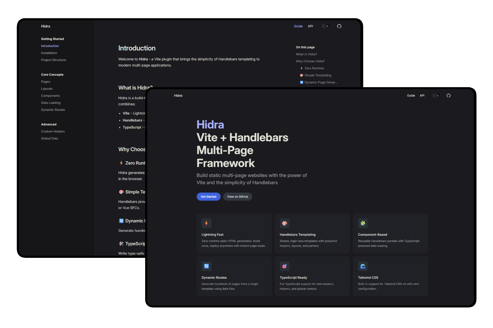

# Hidra

A Vite static site generation plugin for building multi-page applications with Handlebars templates.

Hidra integrates Handlebars templating into Vite's build pipeline using virtual HTML modules. It provides a convention-based file structure where `.hbs` templates in a `pages/` directory are automatically compiled into HTML output files. Layouts, components, and helpers are auto-registered from their respective directories, and data loading is handled through companion `.data.ts` files.

It handles templating with custom helpers for handlebars, nested layout inheritance, file watching with hot module replacement, virtual html modules, on-demand dev server rendering, and dynamic route expansion.



> This project was created as a learning exercise to explore Handlebars templating and Vite plugin development. It is not intended for production use.

[](https://vitejs.dev)
[](https://handlebarsjs.com)
[](https://typescriptlang.org)
[](https://pnpm.io)

## Packages

### @hidrajs/vite-plugin

The main Vite plugin. It scans pages, creates virtual html modules, handles dynamic routes, and renders handlebars templates with layout chaining and section/slot support. Auto-registers components and helpers. Provides dev server middleware for on-demand rendering and implements HMR.

### @hidrajs/loader

Utility package with wrapper functions for data loading.

- `root()` for global data
- `loader()` for per-page data
- and `dynamic()` for route expansion.

Provides TypeScript types for each function so development experience is smoother.

### create-hidra

CLI scaffolding tool. Creates a new Hidra project with pre-configured file structure and template files. Copies from a bundled `template/` directory and updates `package.json`.

### @hidrajs/docs

Documentation site built with VitePress. hosts guides, api reference, and documentation.

### @hidrajs/example

Example application demonstrating hidra's features. A standard Vite project using `@hidrajs/vite-plugin` and `@hidrajs/loader` with sample pages, layouts, components, and helpers.

---

## Features

- Virtual HTML Modules for native Vite asset hashing
- Convention-based page discovery from file system
- TypeScript support with type inference for data loaders
- Nested layouts with `{{#layout}}` helper
- Layout caching with circular dependency detection
- Sections and slots with `{{#section}}` and `{{yield}}`
- Auto-registered components as Handlebars partials
- Auto-registered helpers from `helpers/` directory
- Global (`global.ts`) data loader running once
- Per-page (`.data.ts`) data loaders with `loader()` wrapper
- Dynamic routes via `dynamic()` loader
- Hot module replacement on template and data changes

## Quick Start

This is a monorepo managed with pnpm workspaces.

```bash
# Install dependencies
pnpm install

# Run all tests
pnpm test

# Build all packages
pnpm build

# Run lint
pnpm lint

# Format code
pnpm format

# Run the example app in development mode
pnpm --filter @hidrajs/example dev

# Build the example app
pnpm --filter @hidrajs/example build

# Preview the example app in production mode
pnpm --filter @hidrajs/example preview
```

## License

GNU Public License v3.0 see [LICENSE](./LICENSE) for details.

You are free to use, modify, and distribute this software provided that all documentation and materials mentioning this project credit the original author.
